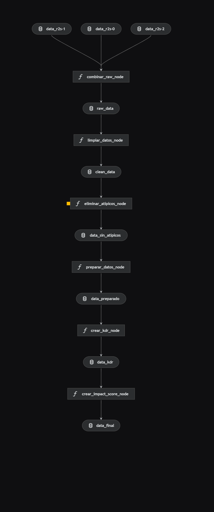

# Rainbow six-ML
[](https://kedro.org)
[](https://www.python.org/)
[](https://www.docker.com/)
[](https://airflow.apache.org/)

# Introducción

Este proyecto utiliza el dataset público Rainbow Six Siege (partidas clasificadas), que reúne información detallada sobre desempeño, rondas, armas y resultados. Lo elegimos por su riqueza en variables numéricas y categóricas, ideal para construir un flujo de analítica y modelamiento reproducible.

Nuestro objetivo es explorar, preparar y modelar los datos para detectar patrones de rendimiento y predecir resultados clave. El pipeline se implementa con Kedro, el versionado de datos y modelos se gestiona con DVC y la orquestación puede ejecutarse en Docker/Airflow, garantizando trazabilidad de extremo a extremo desde datos crudos hasta reportes y modelos.


# link de presentacion:

- presentacion Evaluacion 1:
  
https://drive.google.com/drive/u/1/folders/1vz7rHZXatlKeL6fMcaJgfJqaq3vaHJgE

- presentacion de correccion evaluacion 2:
  
 https://drive.google.com/file/d/13UwVsTS9r4Ooa1QtTrOsd-HNxAxEk274/view?usp=sharing


| Document | Description |
|----------|-------------|
| **[Docker](./docker/readme-docker.md)** | configuracion de docker y servicios |
| **[pipeline](./Pipeline.md)** |ejecutacion de Pipeline  |
| **[Airflow+docker+dvc](./README.AIRFLOW.md)** | comandos de airflow y dvc |
| **[DVC (local)](./README.DVC.md)** | guía de instalación y guardado local con DVC |

## Características principales

-  Pipelines reproducibles: Flujos modulares y reproducibles creados con Kedro para procesar y preparar el dataset Rainbow Six Siege.  
-  Contenedores: Desarrollo y despliegue con Docker (incluye compose para servicios auxiliares).  
-  Orquestación: Integración con Apache Airflow (Airflow + Docker) para programar y monitorizar ejecuciones.  
-  Versionado de datos y modelos: DVC para versionado de datasets, modelos y artefactos; resultados en data/08_reporting.  
-  Marco de pruebas: Tests automatizados con pytest para validación de pipelines y transformaciones.  
-  Visualización: Kedro-Viz para explorar el grafo de pipelines y entender dependencias.  
-  Configurable: Perfiles y configuraciones separadas para entornos (desarrollo, pruebas, producción).  
-  Notebooks reproducibles: Soporte para kedro jupyter para exploración interactiva y documentación.  
-  Informes automáticos: Generación de métricas y reportes reproducibles para seguimiento de resultados.


# Estructura del proyecto
Para la realización de este proyecto se desarrollo a través de de 3 fases:

Fase 1: Business Understanding
En esta fase definimos el objetivo principal del proyecto:
Analizar y preparar los datos de Rainbow Six Siege para detectar patrones en el juego.
Identificar comportamientos atípicos y variables clave que impactan el principalmente en el rendimiento.
Establecer un pipeline reproducible con Kedro, que permita la automatización del proceso de análisis.

Fase 2: Data Understanding
En esta fase se realizamos una exploración inicial de los datos:
Revisión de la estructura de los datasets.
Identificación de valores nulos y duplicados.
Clasificación de variables en numéricas y categóricas.
Histogramas de distribución.
Boxplots para detectar outliers.
Mapas de calor para evaluar correlaciones entre variables.
Análisis específico del uso de armas primarias y secundarias.

Fase 3: Data Preparation
En esta fase se realizamos las transformaciones necesarias para preparar los datos antes del modelado:
Combinación de datasets en un único dataset.
Limpieza de datos, eliminando duplicados y valores faltantes.
Tratamiento de outliers, generando un dataset depurado.
Generación de variables derivadas, como el cálculo del K/D ratio (Kills/Deaths).
Normalización y estructuración de los datos para obtener un dataset final listo para futuras fases de modelado.

Fase 4: Modelamiento
En esta fase entrenamos y comparamos 5 algoritmos para clasificación y 5 para regresión. El prototipado se realizó en Jupyter y luego se trasladó a dos pipelines de Kedro (clasificación y regresión) para ejecución reproducible. Cada modelo se validó con k-fold y métricas adecuadas (Accuracy/F1 en clasificación; R²/RMSE en regresión); finalmente se seleccionó el mejor modelo para cada tarea y se registraron artefactos y resultados.


### Visualizacion de procesamiento de los datos en pipeline con kedro viz



<!-- Versión SVG del diagrama de Kedro Viz -->


## Resultados de los modelos (resumen)

Tablas generadas automáticamente (última ejecución) desde `proyecto-ml/data/08_reporting/*`.

### Clasificación (CV Mean ± Std)

| Modelo | Accuracy | Precision | Recall | F1-Score | CV Mean ± Std |
|---|---:|---:|---:|---:|---:|
| Logistic Regression | 0.7288 | 0.7802 | 0.7288 | 0.7103 | 0.7320 ± 0.0026 |
| K-Nearest Neighbors | 0.9011 | 0.9011 | 0.9011 | 0.9010 | 0.9008 ± 0.0014 |
| Support Vector Machine | 0.7301 | 0.7856 | 0.7301 | 0.7108 | 0.7333 ± 0.0019 |
| Decision Tree | 0.9052 | 0.9052 | 0.9052 | 0.9051 | 0.9064 ± 0.0020 |
| Random Forest | 0.9036 | 0.9036 | 0.9036 | 0.9036 | 0.9050 ± 0.0010 |

Mejor por CV: Decision Tree (0.9064)

### Regresión (CV Mean ± Std)

| Modelo | R² | RMSE | MAE | MSE | CV Mean ± Std |
|---|---:|---:|---:|---:|---:|
| Linear Regression | 0.6895 | 0.4354 | 0.2969 | 0.1896 | 0.6933 ± 0.0038 |
| Multiple Linear Regression | 0.6895 | 0.4354 | 0.2969 | 0.1896 | 0.6933 ± 0.0038 |
| Decision Tree | 0.7925 | 0.3560 | 0.1559 | 0.1267 | 0.7901 ± 0.0027 |
| Random Forest | 0.7946 | 0.3541 | 0.1569 | 0.1254 | 0.7931 ± 0.0027 |
| XGBoost | 0.7948 | 0.3540 | 0.1640 | 0.1253 | 0.7938 ± 0.0033 |

Mejor por CV: XGBoost (0.7938)

# Instrucciones del proyecto
- Pasos de instalación para ejecutar el proyecto:

1. Creación del entorno virtual
   
    ```bash
    python -m venv venv
    ```
2. Activación del entorno virtual
   
    En Windows
     ```bash
     venv\Scripts\activate
     ```
  
    En macOS/Linux:
  
     ```bash
     source venv/bin/activate
     ```
4. Instalación de librerías necesarias:
- Con el entorno ya creado y activado, ejecute `requirements.txt`
    ```bash
    pip install -r requirements.txt
    ```

3. Verificar que Kedro está instalado
    Verifique que Kedro esté instalado para poder ejecutar
    ```bash
       kedro info
    ```

# Cómo trabajar en Kedro usando Jupyter Notebook
- Para utilizar Kedro y trabajar con Notebooks de Jupyter, revise [la documentación de Kedro](https://docs.kedro.org/en/1.0.0/tutorials/notebooks_tutorial).

  
1. Instalar Jupyter antes de utilizar
    ```bash
    pip install jupyter
    ```
2. Entrar al entorno del proyecto
    ```bash
    cd proyecto-ml
    ```

3. Después, ejecute para poder trabajar en los notebooks de forma local en el navegador
    ```bash
    kedro jupyter notebook
    ```


# Referencia: 
https://www.kaggle.com/datasets/maxcobra/rainbow-six-siege-s5-ranked-dataset


